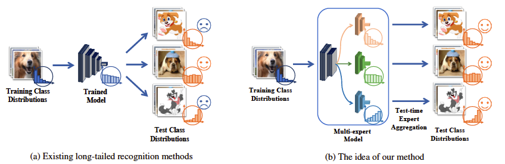

# Test-Agnostic Long-Tailed Recognition 

This repository is the official Pytorch implementation of Test-Agnostic Long-Tailed Recognition by Test-Time Self-Supervised Aggregating Diverse Experts (TADE).
* Based on a new expertise-diverse expert learning strategy, our method learns three expertise-diverse experts, where each one is skilled in a specific class distribution.
* Based on a new test-time self-supervised learning strategy, our method aggregates the three expertise-diverse experts to handle arbitrary test class distributions during the test time.

<p align="center">

</p>

## Results 
### ImageNet-LT (ResNeXt-50)
Long-tailed recognition with uniform test class distribution:

|    Methods   |  MACs(G) | Top-1 acc. |   Model  |  
| ------------ | -------- | ---------- | -------- |
|    Softmax   |   4.26   |    48.0    |          |
|     RIDE     |   6.08   |    56.3    |          |
|  TADE (ours) |   6.08   |    58.8    | [Download](https://drive.google.com/file/d/1xr6RpXlYOt_SetIbonVAVenf5GyNrR1W/view?usp=sharing) | 

Test-agnostic long-tailed recognition:

|    Methods   |  MACs(G) | Forward-50 | Forward-10 |  Uniform  | Backward-10 | Backward-50 |      
| ------------ | -------- | ---------- | ---------- | --------- | ----------- | ----------- |
|    Softmax   |   4.26   |    66.1    |    60.3    |    48.0   |    34.9     |    27.6     |   
|     RIDE     |   6.08   |    67.6    |    64.0    |    56.3   |    48.7     |    44.0     |    
|  TADE (ours) |   6.08   |    69.4    |    65.4    |    58.8   |    54.5     |    53.1     |   


### CIFAR100-Imbalance ratio 100 (ResNet-32)
Long-tailed recognition with uniform test class distribution： 

|    Methods   |  MACs(G) | Top-1 acc. |
| ------------ | -------- | ---------- |
|    Softmax   |   0.07   |    41.4    |
|     RIDE     |   0.11   |    48.0    |
|  TADE (ours) |   0.11   |    49.8    |

Test-agnostic long-tailed recognition： 

|    Methods   |  MACs(G) | Forward-50 | Forward-10 |  Uniform  | Backward-10 | Backward-50 |      
| ------------ | -------- | ---------- | ---------- | --------- | ----------- | ----------- |
|    Softmax   |   0.07   |    62.3    |    56.2    |    41.4   |    25.8     |    17.5     |   
|     RIDE     |   0.11   |    63.0    |    57.0    |    48.0   |    35.4     |    29.3     |    
|  TADE (ours) |   0.11   |    65.9    |    58.3    |    49.8   |    43.9     |    42.4     |    


### Places-LT (ResNet-152)
Long-tailed recognition with uniform test class distribution:
 
|    Methods   |  MACs(G) | Top-1 acc. |
| ------------ | -------- | ---------- |
|    Softmax   |  11.56   |    31.4    |
|     RIDE     |  13.18   |    40.3    |
|  TADE (ours) |  13.18   |    40.9    |

Test-agnostic long-tailed recognition:

|    Methods   |  MACs(G) | Forward-50 | Forward-10 |  Uniform  | Backward-10 | Backward-50 |      
| ------------ | -------- | ---------- | ---------- | --------- | ----------- | ----------- |
|    Softmax   |  11.56   |    45.6    |    40.2    |    31.4   |     23.4    |    19.4     |   
|     RIDE     |  13.18   |    43.1    |    41.6    |    40.3   |     38.2    |    36.9     |    
|  TADE (ours) |  13.18   |    46.4    |    43.3    |    40.9   |     41.4    |    41.6     |    


### iNaturalist 2018 (ResNet-50)
Long-tailed recognition with uniform test class distribution: 

|    Methods   |  MACs(G) | Top-1 acc. |
| ------------ | -------- | ---------- |
|    Softmax   |   4.14   |    64.7    |
|     RIDE     |   5.80   |    71.8    |
|  TADE (ours) |   5.80   |    72.9    |

Test-agnostic long-tailed recognition: 

|    Methods   |  MACs(G) | Forward-3 | Forward-2 |  Uniform  | Backward-2 | Backward-3 |      
| ------------ | -------- | --------- | --------- | --------- | ---------- | ---------- |
|    Softmax   |   4.14   |   65.4    |   65.5    |    64.7   |    64.0    |    63.4    |   
|     RIDE     |   5.80   |   71.5    |   71.9    |    71.8   |    71.9    |    71.8    |    
|  TADE (ours) |   5.80   |   72.3    |   72.5    |    72.9   |    73.5    |    73.3    |   
 


## Requirements
* To install requirements: 
```
pip install -r requirements.txt
```

### Hardware requirements
8 GPUs with >= 11G GPU RAM are recommended. Otherwise the model with more experts may not fit in, especially on datasets with more classes (the FC layers will be large). We do not support CPU training, but CPU inference could be supported by slight modification.

## Datasets
### Four bechmark datasets 
* Please download these datasets and put them to the /data file.
* ImageNet-LT and Places-LT can be found at [here](https://drive.google.com/drive/u/1/folders/1j7Nkfe6ZhzKFXePHdsseeeGI877Xu1yf).
* iNaturalist data should be the 2018 version from [here](https://github.com/visipedia/inat_comp).
* CIFAR-100 will be downloaded automatically with the dataloader.

```
data
├── ImageNet_LT
│   ├── test
│   ├── train
│   └── val
├── CIFAR100
│   └── cifar-100-python
├── Place365
│   ├── data_256
│   ├── test_256
│   └── val_256
└── iNaturalist 
    ├── test2018
    └── train_val2018
```

### Txt files
* We provide txt files for test-agnostic long-tailed recognition for ImageNet-LT, Places-LT and iNaturalist 2018. CIFAR-100 will be generated automatically with the code.
* For iNaturalist 2018, please unzip the iNaturalist_train.zip.
```
data_txt
├── ImageNet_LT
│   ├── ImageNet_LT_backward2.txt
│   ├── ImageNet_LT_backward5.txt
│   ├── ImageNet_LT_backward10.txt
│   ├── ImageNet_LT_backward25.txt
│   ├── ImageNet_LT_backward50.txt
│   ├── ImageNet_LT_forward2.txt
│   ├── ImageNet_LT_forward5.txt
│   ├── ImageNet_LT_forward10.txt
│   ├── ImageNet_LT_forward25.txt
│   ├── ImageNet_LT_forward50.txt
│   ├── ImageNet_LT_test.txt
│   ├── ImageNet_LT_train.txt
│   ├── ImageNet_LT_uniform.txt
│   └── ImageNet_LT_val.txt
├── Places_LT_v2
│   ├── Places_LT_backward2.txt
│   ├── Places_LT_backward5.txt
│   ├── Places_LT_backward10.txt
│   ├── Places_LT_backward25.txt
│   ├── Places_LT_backward50.txt
│   ├── Places_LT_forward2.txt
│   ├── Places_LT_forward5.txt
│   ├── Places_LT_forward10.txt
│   ├── Places_LT_forward25.txt
│   ├── Places_LT_forward50.txt
│   ├── Places_LT_test.txt
│   ├── Places_LT_train.txt
│   ├── Places_LT_uniform.txt
│   └── Places_LT_val.txt
└── iNaturalist18
    ├── iNaturalist18_backward2.txt
    ├── iNaturalist18_backward3.txt
    ├── iNaturalist18_forward2.txt
    ├── iNaturalist18_forward3.txt
    ├── iNaturalist18_train.txt
    ├── iNaturalist18_uniform.txt
    └── iNaturalist18_val.txt 
```


## Pretrained models
* For the training on Places-LT, we follow previous method and use [the pre-trained model](https://drive.google.com/drive/u/1/folders/1j7Nkfe6ZhzKFXePHdsseeeGI877Xu1yf).
* Please download the checkpoint. Unzip and move the checkpoint files to /model/pretrained_model_places/.


## Script

### ImageNet-LT
#### Training
* To train the expertise-diverse model, run this command:
```
python train.py -c configs/config_imagenet_lt_resnext50_tade.json
```

#### Evaluate
* To evaluate expertise-diverse model on the uniform test class distribution, run:
``` 
python test.py -r checkpoint_path
``` 

* To evaluate expertise-diverse model on agnostic test class distributions, run:
``` 
python test_all_imagenet.py -r checkpoint_path
``` 

#### Test-time training
* To test-time train the expertise-diverse model for agnostic test class distributions, run:
``` 
python test_train_imagenet.py -c configs/test_time_imagenet_lt_resnext50_tade.json -r checkpoint_path
``` 


### CIFAR100-LT 
#### Training
* To train the expertise-diverse model, run this command:
```
python train.py -c configs/config_cifar100_ir100_tade.json
```
* One can change the imbalance ratio from 100 to 10/50 by changing the config file.

#### Evaluate
* To evaluate expertise-diverse model on the uniform test class distribution, run:
``` 
python test.py -r checkpoint_path
``` 

* To evaluate expertise-diverse model on agnostic test class distributions, run:
``` 
python test_all_cifar.py -r checkpoint_path
``` 

#### Test-time training
* To test-time train the expertise-diverse model for agnostic test class distributions, run:
``` 
python test_train_cifar.py -c configs/test_time_cifar100_ir100_tade.json -r checkpoint_path
``` 
* One can change the imbalance ratio from 100 to 10/50 by changing the config file.
 

### Places-LT
#### Training
* To train the expertise-diverse model, run this command:
```
python train.py -c configs/config_places_lt_resnet152_tade.json
```

#### Evaluate
* To evaluate expertise-diverse model on the uniform test class distribution, run:
``` 
python test_places.py -r checkpoint_path
``` 

* To evaluate expertise-diverse model on agnostic test class distributions, run:
``` 
python test_all_places.py -r checkpoint_path
``` 

#### Test-time training
* To test-time train the expertise-diverse model for agnostic test class distributions, run:
``` 
python test_train_places.py -c configs/test_time_places_lt_resnet152_tade.json -r checkpoint_path
``` 

### iNaturalist 2018
#### Training
* To train the expertise-diverse model, run this command:
```
python train.py -c configs/config_iNaturalist_resnet50_tade.json
```

#### Evaluate
* To evaluate expertise-diverse model on the uniform test class distribution, run:
``` 
python test.py -r checkpoint_path
``` 

* To evaluate expertise-diverse model on agnostic test class distributions, run:
``` 
python test_all_inat.py -r checkpoint_path
``` 

#### Test-time training
* To test-time train the expertise-diverse model for agnostic test class distributions, run:
``` 
python test_train_inat.py -c configs/test_time_iNaturalist_resnet50_tade.json -r checkpoint_path
``` 

## Citation
If you find our work inspiring or use our codebase in your research, please cite our work.
```
@article{zhang2021test,
  title={Test-Agnostic Long-Tailed Recognition by Test-Time Self-Supervised Aggregating Diverse Experts},
  author={Zhang, Yifan and Feng, Jiashi},
  journal={arXiv},
  year={2021}
}
``` 

## Acknowledgements
This is a project based on this [pytorch template](https://github.com/victoresque/pytorch-template). 

The mutli-expert framework are based on [RIDE](https://github.com/frank-xwang/RIDE-LongTailRecognition). The data generation of agnostic test class distributions takes references from [LADE](https://github.com/hyperconnect/LADE).
